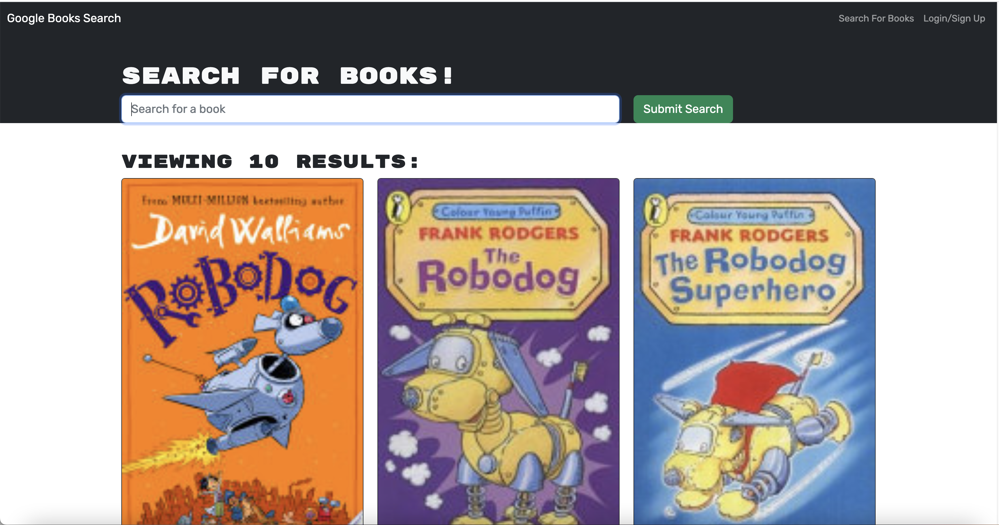
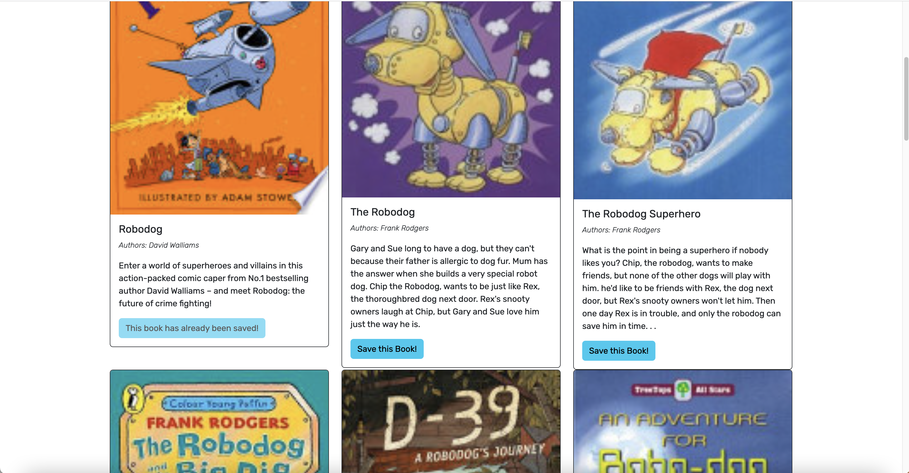
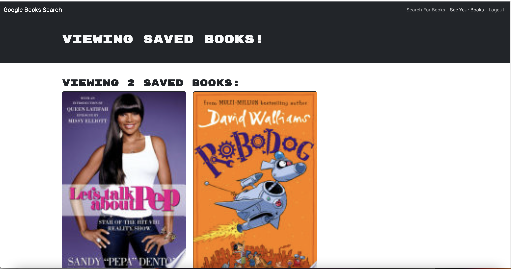

# Book Search

## Description

The Book search engine uses the MERN stack and with a React front end, MongoDB database, and Node js & Express js server. It's set up to allow users to save book searches to their profile and view the books and their details. The application is built using Google Books API so that users can click a link that takes them to google books. The search engine is built with GraphQL API and Apollo Server.
## Installation

To install necessary dependencies, run the following command:

npm i &
## Usage

To use the application from the command line (after installing dependencies):

Open the root directory of the repository in your terminal or bash. Bundle the front-end code by entering npm run build in the command line. Start the server by entering npm run develop in the command line.

https://github.com/ZDastan/book-search
